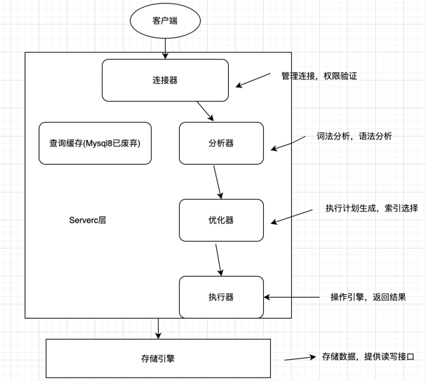
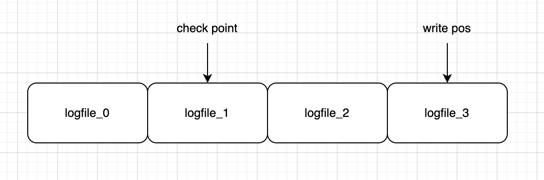
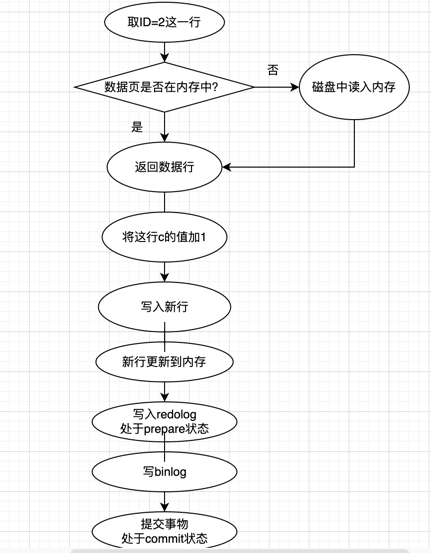
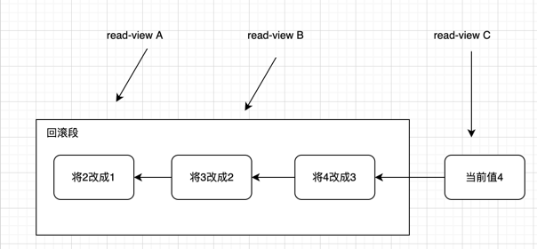

# Mysql-Knowledge
Mysql学习知识记录

**一条SQL查询语句是如何执行的？** 
 

**一条SQL更新语句是如何执行的？** 
你可能会听到DBA同事说，Mysql可以恢复到半个月内任意一秒的状态 

更新语句和查询语句不同的是：更新流程还涉及到两个重要的日志模块：**redo log(重做日志)** 和 **binlog(归档日志)** 
如果每次更新操作都需要写进磁盘，然后磁盘也要找到那条记录，然后再更新，整个过程IO成本、查找成本都非常高。 

**重要的日志模块：redo log** 
Mysql中经常说到的**WAL技术**，全称 Write-Ahead Logging，它的关键点就是先写日志，再写磁盘。 

InnoDB中的redo log是固定大小的，比如可以配置为一组4个文件，每个文件的大小是1GB，那么就可以记录4GB的操作。从头开始写，写到末尾就又回到开头循环写，如下图所示 
 
**write pos是当前记录的位置**，一边写一边后移，写到3号文件末尾就回到0号文件开头。 
**checkpoint是当前要擦除的位置**，也是往后推移并且循环的，擦除记录前要把记录更新到数据文件。 
从write pos到checkpoint之间的部分，为空着的部分，可以记录新的操作。当write pos追上checkpoint，表示满了，不能执行新的更新，得先停下来擦掉一些记录，把checkpoint推进一下。 

有了redo log，可以保证数据库发生异常重启，之前提交的记录都不会丢失，这个能力称为**crash-safe** 

**重要的日志模块：binlog** 
Mysql整体看，分为两块，Server层，和引擎层。上面说的redo log是InnoDB引擎特有的日志，而Server层也有自己的日志，称为binlog(归档日志)。 
Binlog有两种模式，statement 格式的话是记sql语句， row格式会记录行的内容，记两条，更新前和更新后都有。 

两种日志的不同点： 
1.redo log是InnoDB引擎特有的；binlog是Mysql的Server层实现的，所有引擎都可以使用. 
2.redo log是物理日志，记录的是"在某个数据页上做了什么修改"；binlog是逻辑日志，记录的是这个语句的原始逻辑，比如“给ID=2这一行的c字段加1”. 
3.redo log是循环写的，空间固定会用完；binlog是可以追加写入的。"追加写是指binlog文件写到一定大小后会切换到下一个，并不会覆盖以前的日志". 

**这个简单update语句的执行流程**。update T set c=c+1 where ID=2;  
1.执行器首先会找引擎ID=2的这行数据。如果ID=2这一行所在的数据页本来就在内存中，就直接返回给执行器；否则需要先从磁盘读入内存，然后再返回 
2.执行器拿到引擎给的数据，把这个值加1，得到一行新的数据，再调用引擎接口，写入这行新的数据 
3.引擎将这行新的数据更新到内存中，同时将这个更新操作记录在redo log里面，此时redo log处于prepare状态。然后告知执行器执行完成了，随时可以提交事物 
4.执行器生成这个操作的binlog，并把binlog写入磁盘 
5.执行器调用引擎的提交事物接口，引擎把刚刚写入的redo log改成提交(commit)状态，更新完成 
 

redo log将写入的步骤拆成了两个步骤：prepare和commit，这就是"两阶段提交" 
怎样让数据库恢复到半个月内任意一秒的状态？ 
前面说过，binlog会记录所有的逻辑操作，并且是采用"追加写"的形式。如果可以恢复半个月，那么备份系统中一定会保存半个月的所有binlog，同时系统会定期做整库备份 
怎么做？首先找到最近一次的全量备份，然后从备份的时间点开始，将备份的binlog依次取出，重放到误删之前的时刻 

**为什么需要两阶段提交?** 
反证法: 
假设执行update语句过程中在写完第一个日志后，第二个日志还没有写完期间发生了crash，会出现什么情况呢？ 
1.先写redo log，再写binlog。假设在redo log写完，binlog还没写完时，Mysql进程异常重启。前面说过redo log写完之后，即使系统崩溃，仍然能够把数据恢复过来，所以恢复这一行c的值是1。 
 但由于binlog还没写完就crash了，这时候binlog里面就没有记录这条语句，之后如果用binlog恢复临时库的时候，由于binlog语句的丢失，临时库就会少这一次更新。 
2.先写binlog后写redo log。如果在binlog写完之后，crash了，由于redo log还没有写入，崩溃恢复后这个事务无效，所以这一行c的值是0。 
 但是binlog里面已经记录了“把c从0改成1”这个日志，所以之后用binlog再恢复的时候就多了一个事务，会与原库值不同 

**事务隔离级别：** 
读未提交是指，一个事务还没提交时，它做的变更就能被别的事务看到。 
读提交是指，一个事务提交之后，它做的变更才会被其他事务看到。 
可重复读是指，一个事务执行过程中看到的数据，总是跟这个事务在启动时看到的数据是一致的。当然在可重复读隔离级别下，未提交变更对其他事务也是不可见的。 
串行化，顾名思义是对于同一行记录，“写”会加“写锁”，“读”会加“读锁”。当出现读写锁冲突的时候，后访问的事务必须等前一个事务执行完成，才能继续执行。 

**可重复读的事务隔离级别的实现** 
在Mysql中，每条记录在更新的时候，都会记录一条回滚操作。记录上最新的值，都可以通过回滚操作，都可以得到前一个状态的值 
假设一个值从1被按顺序改成了2、3、4，在回滚日志里面就会有类似下面的记录。 
 
当前值是4，但是在查询这条记录的时候，不同时刻启动的事务会有不同的read-view。如上图看到的，在视图A、B、C里面，这个记录的值分别是1、2、4，同一条记录在系统中可以存在多个版本，就是数据库的多版本并发控制（MVCC） 

基于上述，所以尽量不要用长事务，因为长事务会保留很老的事务视图，在这个事务提交之前，数据库里面它可能用到的回滚记录都必须保留，这样就会导致大量占用存储空间 

主键索引的叶子节点存储的是整行数据，因此也被称为聚簇索引 
非主键索引的叶子节点存储的是主键的值，非主键索引也被称为二级索引 

**索引维护** 
B+树为了维护索引的有序性，在插入新值时必须做必要的维护，如果插入的是最新的数据，直接就在最新记录后插入即可。但如果在中间插入，就相对麻烦了，需要逻辑上挪到后面的位置，空出位置。 
更糟糕的是，如果前面的数据页满了，根据B+树的算法，这时候需要申请新的数据页，然后挪到部分数据过去，这个过程称为页分裂，这种情况性能自然受影响；除了性能外，页分裂还影响数据页的利用率，原本放在一个页的数据，现在分到两个页中，整体空间利用率降低大约50% 
当相邻页删除数据，利用率低了之后，会将数据页做合并，合并的过程，可以认为是分裂过程的逆过程 
**mysql页的大小16kb。** 

当查非主键索引，得到当是主键的值，再回到主键的B+树上，查对应数据的过程，称为回表 
如果只需要查ID，而ID的值，已经再where条件后的索引树上了，就可以直接提供查询结果，称为覆盖索引，可以显著减少树的搜索次数 

**索引下推** 
对于(name,age)的联合索引，当你去查name like '张%' and age = 20的数据，此时只会用到name的索引，age的索引用不到， 
但是索引下推的特性，会在索引内部就判断，age的值是否是20，不是20的数据，就不会走回表操作，可以有效减少回表次数 

**全局锁** 
全局锁的典型使用场景是，做全库逻辑备份。也就是把整库每个表都select出来存成文本 

**表级锁** 
表级锁:MDL。MDL不需要显示使用，在访问一个表时，会被自动加上。读锁之间不互斥，读写之间互斥。 
当对一个表做增删改查操作的时候，加MDL读锁；当要对表做结构变更操作的时候，加MDL写锁。 
当锁住的时候，此时查询语句十分频繁，而且客户端有重试机制的时候，也就是超时后会再起一个新的session，这个库的线程很快就会爆满， 
事务中的MDL锁，在语句执行开始时申请，但是语句结束后并不会马上释放，而会等到整个事务提交后再释放。 

**如何安全地给小表加字段？** 
首先我们要解决长事务，事务不提交，就会一直占着MDL锁。在MySQL的information_schema 库的 innodb_trx 表中，你可以查到当前执行中的事务。如果你要做DDL变更的表刚好有长事务在执行，要考虑先暂停DDL，或者kill掉这个长事务。 
但考虑一下这个场景。如果你要变更的表是一个热点表，虽然数据量不大，但是上面的请求很频繁，而你不得不加个字段，你该怎么做呢？ 
这时候kill可能未必管用，因为新的请求马上就来了。比较理想的机制是，在alter table语句里面设定等待时间，如果在这个指定的等待时间里面能够拿到MDL写锁最好，拿不到也不要阻塞后面的业务语句，先放弃。之后开发人员或者DBA再通过重试命令重复这个过程。 
ALTER TABLE tbl_name NOWAIT add column ...  
ALTER TABLE tbl_name WAIT N add column ...  

**行锁** 
MyISAM引擎就不支持行锁 
在InnoDB事务中，行锁是在需要的时候才加上的，但并不是不需要了就立刻释放，而是要等到事务结束时才释放。这个就是两阶段锁协议 
如果你的事务中需要锁多个行，要把最可能造成锁冲突、最可能影响并发度的锁尽量往后放 
Mysql会采用**主动死锁检测**，发现死锁后，主动回滚死锁链条中的某一个事务，让其他事务得以继续执行。 
假设有1000个并发线程要同时更新同一行，那么死锁检测操作就是100万这个量级的。虽然最终检测的结果是没有死锁，但是这期间要消耗大量的CPU资源，怎么解决由这种热点行更新导致的性能问题呢？ 
**1.一般不会把死锁当做一个严重错误，毕竟出现死锁了，就回滚，然后通过业务重试一般就没问题了** 
**2.控制并发度,基本思路就是，对于相同行的更新，在进入引擎之前排队。这样在InnoDB内部就不会有大量的死锁检测工作了。** 

**“快照”在MVCC里是怎么工作的？** 
InnoDB里每个事务都有一个唯一的事务ID，每次事务更新数据的时候，都会生成一个新的数据版本, 
并且把transaction id赋值给这个数据版本的事务ID，记为row trx_id。同时，旧的数据版本要保留，并且在新的数据版本中，能够有信息可以直接拿到它。 
每次需要的时候根据当前版本和undo log计算出来的 
InnoDB利用了“所有数据都有多个版本”的这个特性，实现了“秒级创建快照”的能力。 

**更新数据都是先读后写的，而这个读，只能读当前的值，称为“当前读”（current read）** 

**普通索引和唯一索引，应该怎么选择** 
假如一个表里有个字段是身份证号，并且业务上已经保证了不会有重复的身份证号 
**查询过程** 
select id from T where k=5  
对于普通索引来说，查找到满足条件的第一个记录(5,500)后，需要查找下一个记录，直到碰到第一个不满足k=5条件的记录。 
对于唯一索引来说，由于索引定义了唯一性，查找到第一个满足条件的记录后，就会停止继续检索。 
因为InnoDB数据是按数据页来读写的，也就是说读取一条记录的时候，并不是将这条记录从磁盘读出来，而是以页为单位，整体读到内存。每个数据页默认大小16KB。 
如果k=5这个记录刚好是这个数据页的最后一个记录，那么要取下一个记录，必须读取下一个数据页，这个操作会稍微复杂一些。 
但是，我们之前计算过，对于整型字段，一个数据页可以放近千个key，因此出现这种情况的概率会很低。所以，我们计算平均性能差异时，仍可以认为这个操作成本对于现在的CPU来说可以忽略不计。 

**更新过程** 
change buffer：如果更新一个数据页时，数据页在内存中就直接更新；如果不在，InnoDB会将这些更新操作缓存在change buffer中，这样就不需要从磁盘中读入这个数据页了， 
在下次查询需要访问这个数据页时，将数据页读入到内存，就会执行change buffer中与这个数据页有关的操作。 
change buffer在内存中有拷贝，也会被写入到磁盘上。 
将change buffer中的操作应用到原数据页，得到最新结果的过程称为merge。除了访问这个数据页会触发merge外，系统有后台线程会定期merge。在数据库正常关闭（shutdown）的过程中，也会执行merge操作。 

显然，如果能够将更新操作先记录在change buffer，减少读磁盘，语句的执行速度会得到明显的提升。 
而且，数据读入内存是需要占用buffer pool的，所以这种方式还能够避免占用内存，提高内存利用率。 
唯一索引的更新就不能使用change buffer，实际上也只有普通索引可以使用。 
这个记录要更新的目标页在内存中： 
对于唯一索引来说，找到3和5之间的位置，判断到没有冲突，插入这个值，语句执行结束； 
对于普通索引来说，找到3和5之间的位置，插入这个值，语句执行结束。 
这个记录要更新的目标页不在内存中： 
对于唯一索引来说，需要将数据页读入内存，判断到没有冲突，插入这个值，语句执行结束； 
对于普通索引来说，则是将更新记录在change buffer，语句执行就结束了。 

**小场景**：之前我就碰到过一件事儿，有个DBA的同学跟我反馈说，他负责的某个业务的库内存命中率突然从99%降低到了75%，整个系统处于阻塞状态，更新语句全部堵住。 
而探究其原因后，我发现这个业务有大量插入数据的操作，而他在前一天把其中的某个普通索引改成了唯一索引。 

change buffer的使用场景：写多读少的业务。(账单类、日志类的系统) 
写入之后马上会做查询，就不适合change buffer 

redo log 主要节省的是随机写磁盘的IO消耗（转成顺序写），而change buffer主要节省的则是随机读磁盘的IO消耗。 

merge的执行流程是这样的： 
从磁盘读入数据页到内存（老版本的数据页）； 
从change buffer里找出这个数据页的change buffer 记录(可能有多个），依次应用，得到新版数据页； 
写redo log。这个redo log包含了数据的变更和change buffer的变更。 

Mysql有时候会选错索引，那么可以用force index()，或者修改语义，诱导优化器选择想用的索引 

**怎么给字符串字段加索引**  
MySQL是支持前缀索引的，也就是说，你可以定义字符串的一部分作为索引。默认地，如果你创建索引的语句不指定前缀长度，那么索引就会包含整个字符串 
比如邮箱字段： 
select count(distinct left(email,4)）as L4 from SUser; 
依次选取不同长度的前缀来看这个值，比如我们要看一下4~7个字节的前缀索引。 
建立索引时关注的是区分度，区分度越高越好。因为区分度越高，意味着重复的键值越少 
**使用前缀索引就用不上覆盖索引对查询性能的优化** 

